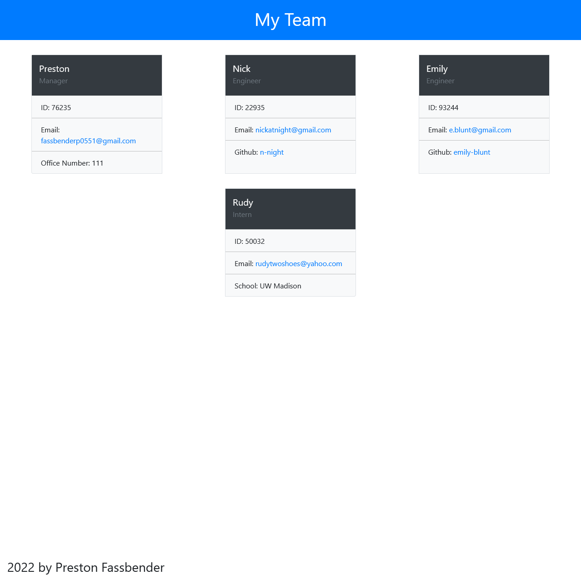

# Team Profile Generator

The aim of this project was to generate a webpage that displays my team's basic information so that I have quick access to their emails and github pages.

## Table of Contents
[Technologies Used](#technologies-used)  
[Installation](#installation)  
[Usage](#use)  
[Media](#media)  
[Questions](#questions)  

## Technologies Used
* Node.js
* JavaScript
* HTML

with a focus on OOP, npm Inquirer, and TDD

---

## Installation
Navigate to the root directory in the terminal and initialize the project with **npm install** to install all the proper node module dependencies

---

## Use
Navigate to the root directory in the terminal and type **node index.js** to run the project

---

## Tests
Navigate to the root directory in the terminal and type **npm run test** to run the project

---

## Media
https://user-images.githubusercontent.com/36012762/153655398-23249c8a-be44-491d-9839-6b2b12e6300a.mp4

The following link is to this project's github repository
https://github.com/p-fassbender/team-profile-generator/

---

## Questions
Any questions feel free to contact me via [my github](https://github.com/p-fassbender) or by sending me an email at fassbenderp0551@gmail.com.

---

## USER STORY
AS A manager
I WANT to generate a webpage that displays my team's basic info
SO THAT I have quick access to their emails and GitHub profiles

## ACCEPTANCE CRITERIA
* GIVEN a command-line application that accepts user input
* WHEN I am prompted for my team members and their information
THEN an HTML file is generated that displays a nicely formatted team roster based on user input
* WHEN I click on an email address in the HTML
THEN my default email program opens and populates the TO field of the email with the address
* WHEN I click on the GitHub username
THEN that GitHub profile opens in a new tab
* WHEN I start the application
THEN I am prompted to enter the team manager’s name, employee ID, email address, and office number
* WHEN I enter the team manager’s name, employee ID, email address, and office number
THEN I am presented with a menu with the option to add an engineer or an intern or to finish building my team
* WHEN I select the engineer option
THEN I am prompted to enter the engineer’s name, ID, email, and GitHub username, and I am taken back to the menu
* WHEN I select the intern option
THEN I am prompted to enter the intern’s name, ID, email, and school, and I am taken back to the menu
* WHEN I decide to finish building my team
THEN I exit the application, and the HTML is generated
